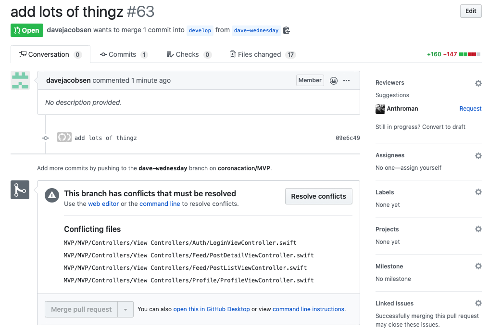
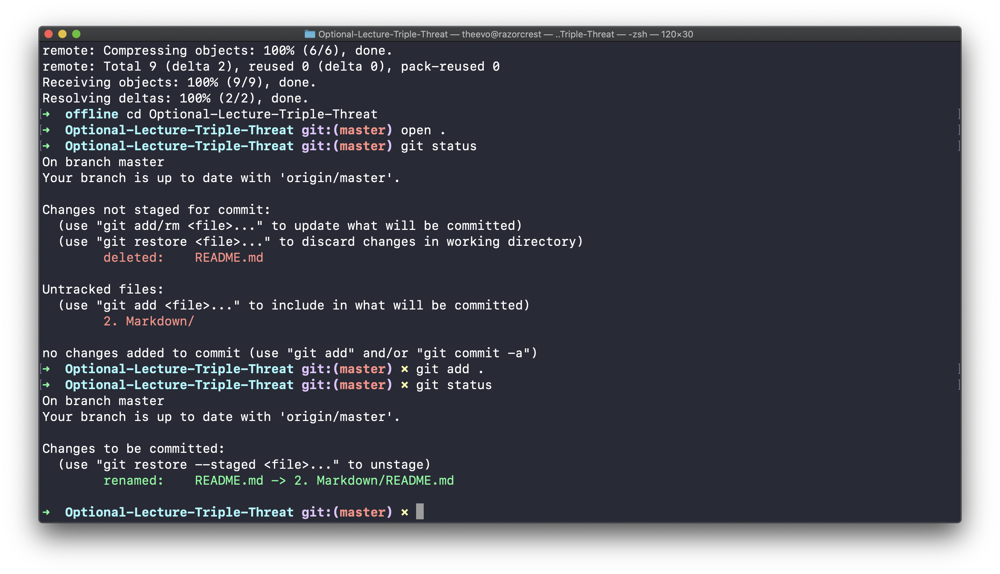
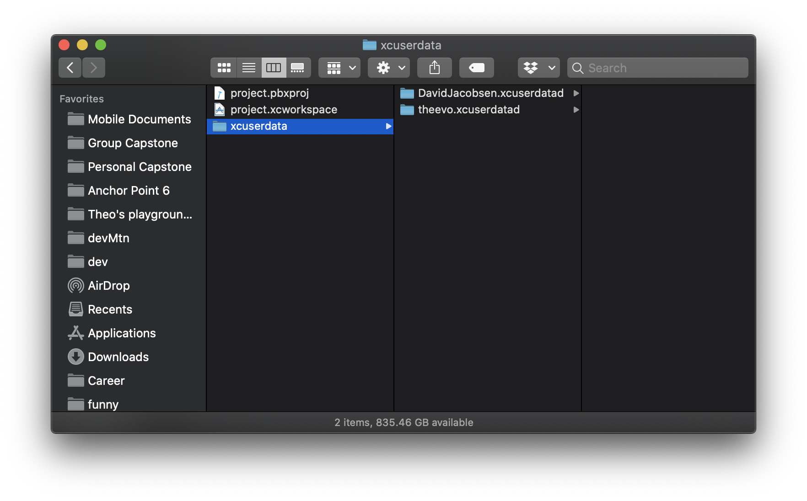

^ Triple Threat

*Optional Lecture*


---

# Terminal
# Markdown
# git

---

Your voice matters

## Chat or speak

But mute if you're not


---

# `whoami`


## Theo Vora
## @theevo
## in/theovora

---

# git


## your thoughts? 

## chat or speak

---


^ GIF: git merge

---

# No GUI
## Why?

---



^ GitHub won't merge this. We have no choice but to resolve it command line.

---

> unless you actually understand the commands that have been produced on your behalf, you're fooling yourself. You're programming by coincidence... If the commands they produce aren’t quite right, or if circumstances change and you need to adapt the commands, you’re on your own.

-- [Jason McCreary](https://jasonmccreary.me/articles/git-command-line-vs-gui/)

---

> If you don't know what the GUI is doing, how can you know what happening to your code?

---


^ Yoda says, "gud git"

# in Terminal

### aka command line

---


^ boring Terminal



^ colorful Terminal

---

# Trick out Terminal

1. Oh My Zsh
2. .gitignore
3. Configure git


^ your Terminal is like a customizable Heads-Up Display

---


# Why .gitignore?

1. For your sanity
2. Avoid conflicts in files that don't matter
3. Remove unnecessary [noise](https://medium.com/@satorusasozaki/swift-gitignore-by-github-explained-b5dc7479c661)

---

# tl;dr


### Thanks, Uncle Jared! 

---

# Where to install .gitignore

## 1. Your computer's git config (protects your repos)
## 2. Your group's git repo (in case theirs failed*)

> \* Trust no one, Dr. Jones. -- Nazi double agent

---

## Make .gitignore the first file you add+commit to your group project repo!

---


^ what are we ignoring? Who is our Xcode Boogeyman?

---


# .DS_Store

### Public Enemy Number 1

---

# srsly .DS_Store sucks

[Death to .DS_Store](https://www.aorensoftware.com/blog/2011/12/24/death-to-ds_store/)

[These programmers removed it manually from their repo](https://github.com/gravitystorm/openstreetmap-carto/pull/3531)

---

# Pods folder


### Public Enemy Number 2

---

# CocoaPods Tangent

Do **not** clone your group project to iCloud Drive.

Do this instead.

```
cd ~
mkdir code
cd code
git clone <your group repo link>
```

---

# .xcuserdata

### Public Enemy Number... who's keeping track?



Your teammates don't care about your personal settings.

Where is this? Show contents of your .xcodeproj

---

## Your turn

# 1. Terminal

---

# Fork me

### [https://github.com/theevo/Optional-Lecture-Triple-Threat](https://github.com/theevo/Optional-Lecture-Triple-Threat)

---

# Where to gitignore from here?

[gitignore explained line by line](https://medium.com/@satorusasozaki/swift-gitignore-by-github-explained-b5dc7479c661)

[Pros and Cons of ignoring Pods folder](https://guides.cocoapods.org/using/using-cocoapods.html#should-i-check-the-pods-directory-into-source-control)

---

# Where to git config from here?

[First-time git setup](https://git-scm.com/book/en/v2/Getting-Started-First-Time-Git-Setup)

Check out colors in the [Official git documentation](https://git-scm.com/book/en/v2/Customizing-Git-Git-Configuration)


---

# You know this


1. On GitHub, Fork
2. `git clone <url>`

---

# clone vs branch?

---

# Hustle & Push

```
git add .
git commit -m "Fix bugs"
git push origin develop
```

---

# 


Level 1. Oh my zsh
Level 2. Dracula
Level 3. Pimp my Term


---


# Defense Against the Dark Arts it is!


---

commands


---


# Markdown

## Who cares?

---

# Why learn Markdown

- README.md
- Xcode Quick Help
- note taking (ex: [1](https://gist.github.com/theevo/c435df8b65821b441e341e05a7d98bac), [2](https://gist.github.com/theevo/37ab1f3c5bbabc71482932d54f566f80), [3](https://github.com/theevo/CloudKit_Set_Schema))
- This slideshow 🙀

---

# Let's play!

# [Dillinger.io](https://dillinger.io)

---

# Where to Markdown from here?

[MarkdownGuide.org](https://www.markdownguide.org/getting-started/)

[NSHipster: Swift Documentation](https://nshipster.com/swift-documentation/)

[UML Diagrams](https://stackedit.io)


---

# git
### darn, thought he forgot


---

## Quick, quick history

---


^ git pwn'd Hitler

---

## Ok, for real this time

---


^ Linus Torvalds: "I'm an egotistical bastard, and I name all my projects after myself. First Linux, now git." Footnote: git is British slag for a stupid or unpleasant person.

---

### git in the creator's own words...

---


^ Theo: stop at 6:15

^ Linus Torvalds: Advantages of git in 10 min for your boss

---

# git themes

* distributed, not centralized
* freedom to branch (and experiment)
* freedom to pull/merge what makes sense

---

# practice

## git x Markdown

---

 

^ Wreck It Ralph: "I'm gonna merge it!"

---

## We're going to make a ~~train wreck~~ merge conflict

---

2. Markdown

---

# git advice to the next class

---

## NO: Push to master
## YES: Pull request from branch to master


^ Github is the best place to pull request from a feature branch to master.

^ My Ruby instructor told me to PR, which is an initialism for Pull Request.

---

# git a git plan

[https://gist.github.com/theevo/2a53ffe0553443d572fbb1c036c7eb07](https://gist.github.com/theevo/2a53ffe0553443d572fbb1c036c7eb07)

---

# Check yo' self (status)


```
git add .
git status
```

```
git pull origin develop
git log
```

---

## project.pbxproj


^ Winter isn't coming. merge conflicts are coming.

---

# Everything in Xcode is a file

- storyboard = XML
- Info.plist = XML
- YourProject.xcodeproj/project.pbxproj = JSON? def text

---


^ Where is pbxproj?

---

# project.pbxproj


* builds your Project Explorer
* every file/group add, move, delete

---

# Read what git is telling you

Google until life makes sense

---

# Abort

```
git merge --abort
```

---


^ Happiness is only real when shared.

---

# 3. git

#### Contains all my git notes (the safe ones)

https://github.com/theevo/gitnotes

---

# Where to git from here?

[MUST WATCH: Linus talks about git at Google Tech Talk (2007)](https://youtu.be/4XpnKHJAok8)

[10 git commands every dev should know](https://www.freecodecamp.org/news/10-important-git-commands-that-every-developer-should-know/)

[learn.co - super thorough](https://learn.co/lessons/git-basics-lab)

---

# aspiring writers & authors?


[Write in Markdown. Version Control in git.](https://opensource.com/article/19/4/write-git)

